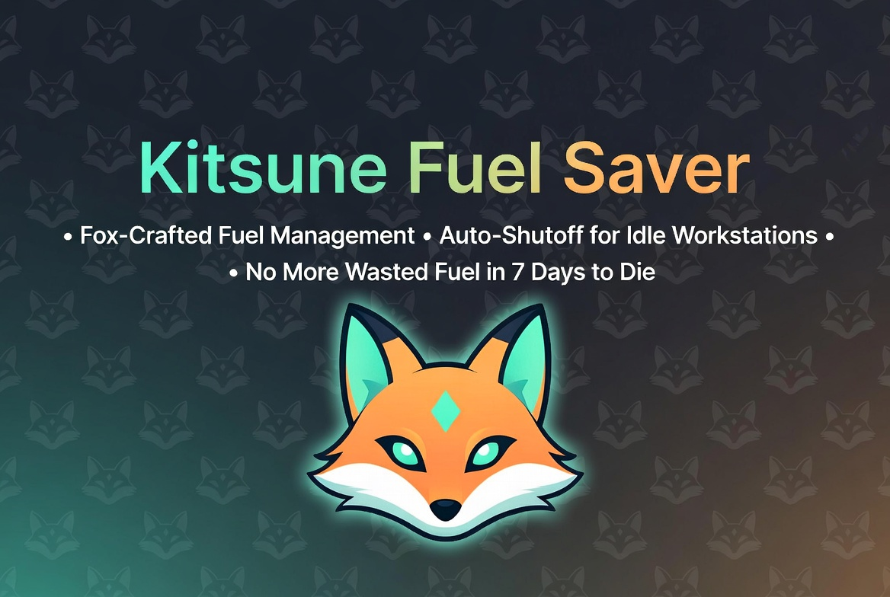

# KitsuneFuelSaver

🦊 **Part of the [Kitsune Systems Collection](https://github.com/Kitsune-Den)** —
[KitsunePvPExtended](https://github.com/Kitsune-Den/KitsunePvPExtended) ·
[KitsuneTrapXP](https://github.com/Kitsune-Den/KitsuneTrapXP) ·
[KitsuneZombieReach](https://github.com/Kitsune-Den/KitsuneZombieReach) ·
[KitsuneKitchen7D](https://github.com/Kitsune-Den/KitsuneKitchen7D) ·
[KitsuneFoxacary](https://github.com/Kitsune-Den/KitsuneFoxacary)



[](https://www.nexusmods.com/7daystodie/mods/10231)
[](https://github.com/Kitsune-Den/KitsuneFuelSaver/releases)
[](https://kitsuneden.net/discord)
[](https://x.com/AdaInTheLab)
[](LICENSE)

You know that thing where you queue up 20 iron in the forge, go fight zombies for an hour, come back, and the forge is still burning through fuel like it forgot it was done three smelts ago?

Yea. This fixes that.

When the craft queue hits zero and there's nothing left to smelt, the fire goes out. Fuel already in the slot stays in the slot. Relight it next time. No more babysitting.

There was a mod that did exactly this back in the A16-ish days and it was the first thing I installed every playthrough. TFP never shipped it. I don't know why. Maybe they think micromanaging fuel while six zombies chew your legs off is a design choice. So.

Here it is. Again. For V2.6.14.

## Install

1. Grab `KitsuneFuelSaver-v1.0.0.zip` from the [Releases](https://github.com/Kitsune-Den/KitsuneFuelSaver/releases) page
2. Extract so `Mods/KitsuneFuelSaver/` ends up in your 7D2D install
3. Launch. You should see `[KitsuneFuelSaver] Loading Harmony patches` in the log

Three files in the mod folder: `ModInfo.xml`, `KitsuneFuelSaver.dll`, and `0Harmony.dll`. The Harmony DLL is bundled because V2.x stopped shipping it in `Managed/`.

**Server-side only.** `TileEntityWorkstation.UpdateTick` runs on the host (your machine in single-player, the host in listen/P2P, the dedi box for dedicated servers). Clients see the effect through the normal state-sync path, so joining players don't need the mod installed. Dedi admins can drop it in and nobody else has to do anything.

## What it actually does

Harmony postfix on `TileEntityWorkstation.UpdateTick`. After the game's normal tick, it checks four things:

- Is the station burning?
- Does it have the fuel module?
- Is the craft queue empty?
- For forges: is all the raw material done smelting?

Yes to all four, it flips `IsBurning` to false. That's the whole mod. About 40 lines of C#.

Non-fueled stations (chem bench, workbench, cement mixer) don't have a fuel module, so the patch short-circuits on them. No weird side effects, no state corruption, it just doesn't do anything to workstations that wouldn't benefit.

## Build it yourself

You need .NET SDK 8+ and a copy of the game. A few of the reference DLLs aren't redistributable so they live outside the repo. Pull these out of your `7DaysToDie_Data/Managed/` folder and drop them in `libs/`:

```
Assembly-CSharp.dll
Assembly-CSharp-firstpass.dll
LogLibrary.dll
UnityEngine.dll
UnityEngine.CoreModule.dll
```

You'll also need `0Harmony.dll`. V2.x doesn't ship it anymore, so either grab a copy from any Harmony-based 7D2D mod you already have installed, or download the latest HarmonyX release for .NET Framework 4.8.

Then:

```
dotnet build -c Release
```

The build outputs straight into the `KitsuneFuelSaver/` folder. That folder is the shippable mod, ready to drop into `Mods/`.

## Compatibility

Built and tested against V2.6.14 on single-player. The state flip goes through `IsBurning`'s setter which already calls `setModified()`, so dedi sync should work through the normal vanilla path. If you hit a case where it doesn't, open an issue.

No load order needed. It ships its own Harmony, patches a vanilla class as a postfix, and coexists with other Harmony mods.

One caveat: if you're running a big overhaul (Darkness Falls, Undead Legacy, etc.) that subclasses `TileEntityWorkstation` instead of using it directly, the patch may not fire on their custom forges. It won't break anything, just won't do its job on those specific stations. Easy fix if that comes up.

## License

MIT. Do whatever.
